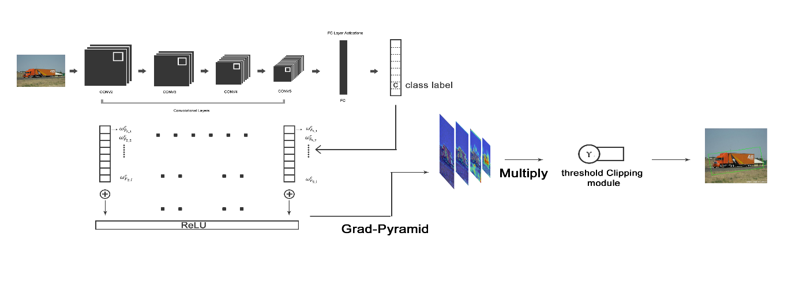
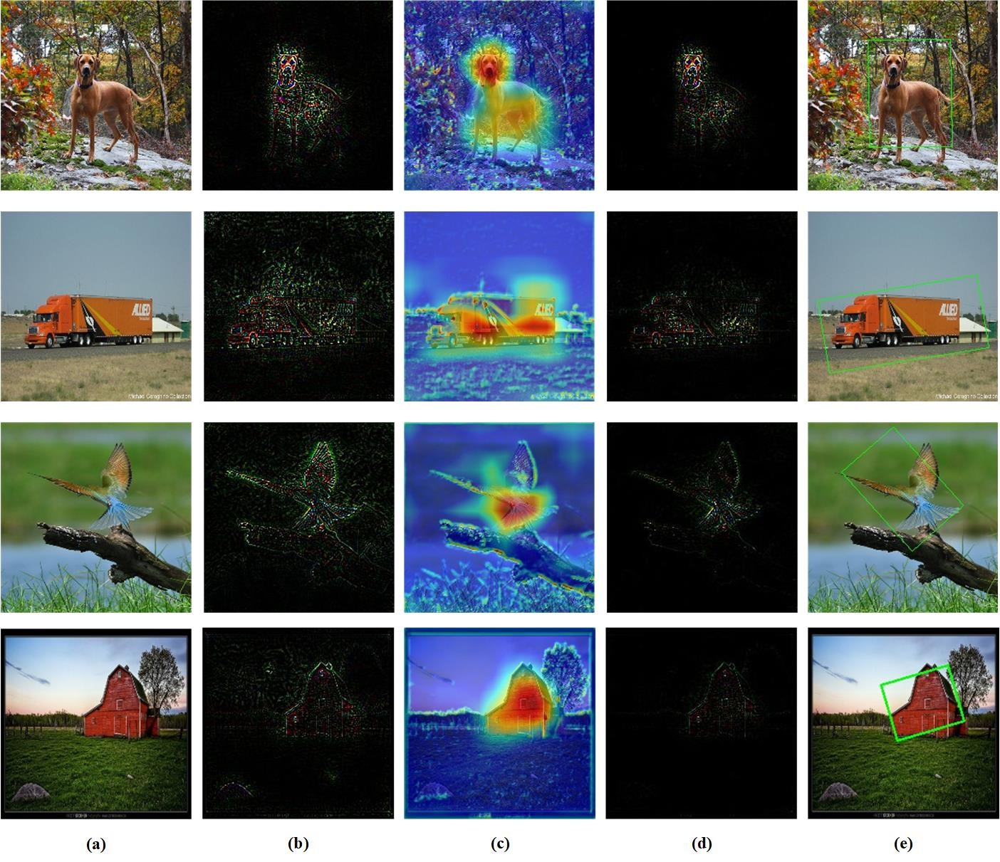

# Gradient pyramid for weakly object detection

## Introduction

We use the Grad-CAM and pyramid to find an confusion feature map for looking the ROI in Imagenet dataset. The code is still optimizing.

## Demo

	the Gradient pyramid network
 

	some results
 

